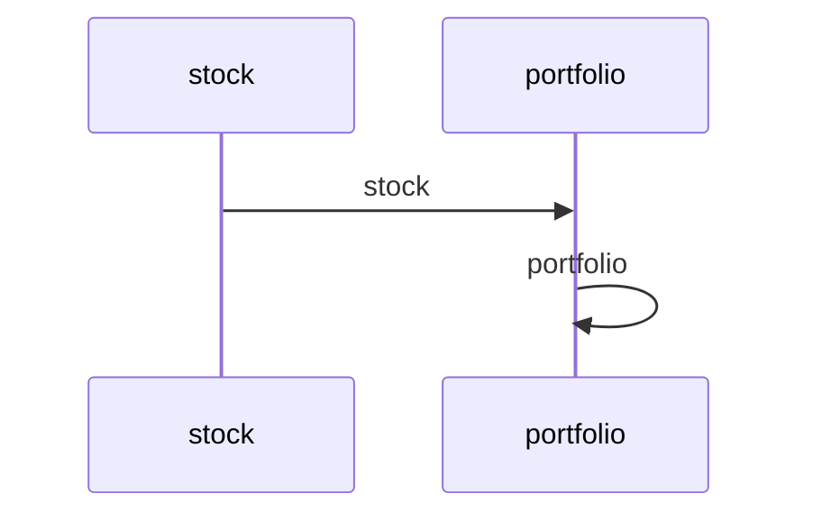

# Quantum Portfolio Optimizer Example

A multi-agent workflow using Maestro: Allows user to select a set of stock then the quantum portfolio optimizer makes the optimized portfolio with the stocks

## Mermaid Diagram

<!-- MERMAID_START -->

<!-- MERMAID_END -->

## Getting Started

* Install [maestro](https://github.com/AI4quantum/maestro):
   ```bash
   pip install git+https://github.com/AI4quantum/maestro.git@v0.1.0
   ```

* Configure environmental variables: `cp example.env .env`

* Copy `.env` to common directory: `cp .env ./../common/src`

## Running the Workflow

Assuming you are in maestro top level:

`maestro deploy demos/workflows/portfolio/agent.yaml demos/workflows/portfolio/workflow.yaml` 

# Portfolio Demo

This demo shows how to use Maestro to create a portfolio management system.

## Setup

1. Install dependencies:
```bash
pip install matplotlib yfinance qiskit-ibm-catalog
```

2. Run the demo:
```bash
maestro run agents.yaml workflow.yaml
```


